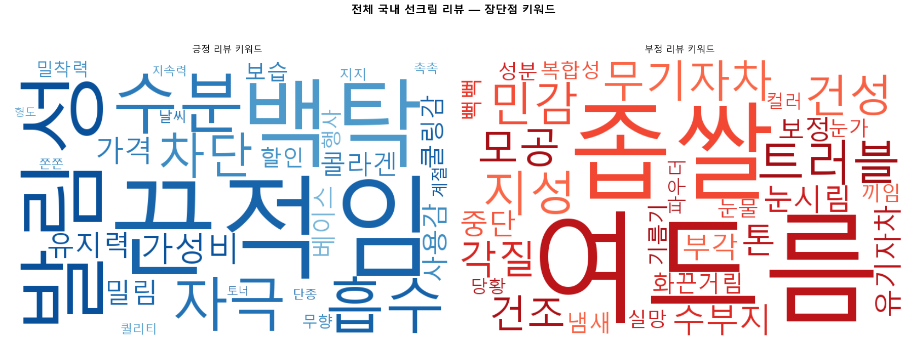
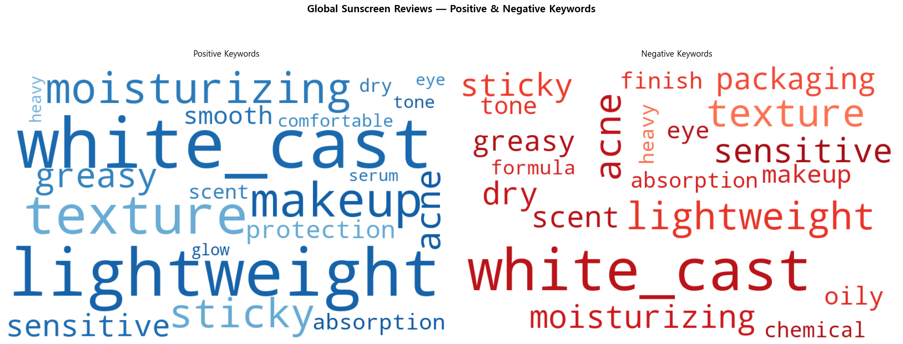
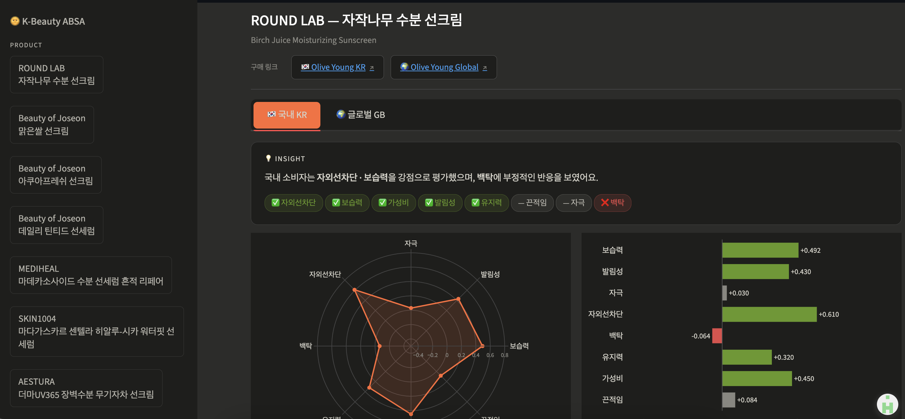

# 🌿 K-Beauty Sunscreen ABSA Dashboard
## 온라인 리뷰 텍스트마이닝을 활용한 K-뷰티 선크림 국내·글로벌 소비자 인식 비교 연구

[](https://python.org)
[](https://ksunscreen-absa-dashboard.streamlit.app)
[](https://github.com/monologg/KoELECTRA)
[](LICENSE)

> 올리브영 국내·글로벌 플랫폼에서 동일한 성분의 선크림 10개 제품에 대한 텍스트 리뷰를 수집하여  
> TF-IDF · N-gram · 연관규칙 · ABSA 4단계 분석 파이프라인으로  
> 국내·글로벌 소비자의 인식 구조 차이를 실증 비교한 연구입니다.

**🔗 [Streamlit 대시보드 바로가기](https://ksunscreen-absa-dashboard.streamlit.app)**

---

## 📌 프로젝트 개요

K-뷰티 제품의 글로벌 유통이 확대되면서, 동일 제품에 대해 국내·해외 소비자가 실제로 어떤 기준으로 제품을 평가하고 있는지에 대한 실증적 이해의 필요성이 커지고 있습니다.
본 프로젝트는 이러한 문제의식에서 출발하여, 국내(올리브영 코리아)와 해외(올리브영 글로벌) 플랫폼에 게재된 동일 선크림 10종의 리뷰 텍스트(국내 10,645건, 해외 6,986건)를 대상으로 소비자 인식의 구조적 차이를 규명하고자 하였습니다.
기존 평점 중심 분석의 한계를 보완하기 위해, TF-IDF 기반 어휘 격차 분석(Gap Analysis) → N-gram 연쇄 표현 분석 → Apriori 연관 규칙 및 네트워크 시각화 → 속성기반 감성분석(ABSA)의 순서로 분석 프레임워크를 설계하였습니다.
이는 단어 수준의 차이 발견에서 속성-감성 수준의 정교한 해석으로 점진적으로 심화되는 구조로, 각 단계의 결과가 다음 단계 분석의 근거로 연결되도록 구성하였습니다.
분석 결과는 Streamlit 기반 인터랙티브 대시보드로 구현하여, 정적인 보고서를 넘어 시장별 소비자 인식 차이를 탐색적으로 확인할 수 있는 형태로 제공하였습니다.

| 항목 | 내용 |
|------|------|
| 분석 플랫폼 | 올리브영 국내 (KR) · 올리브영 글로벌 (GB) |
| 분석 제품 | 동일 선크림 10개 제품 |
| 수집 데이터 | KR 10,645건 / GB 6,986건 (총 17,631건) |
| 분석 기간 | 2025년 4월 18일 ~ 5월 21일 (약 5주) |

---

## 🎯 핵심 발견

```
국내 소비자               글로벌 소비자
"내 피부에 맞는가"    vs   "제형이 가볍고 백탁 없는가"

발림성 중심 복합 허브      lightweight 중심 방사형 구조
끈적임 ABSA +0.115    vs   끈적임 ABSA -0.102
가성비 긍정 상위          price 만족도 1위 (+0.644)
피부타입 언어 집중         메이크업 호환성·packaging 언급
```

---

## 🔍 분석 파이프라인

```
📦 Data Collection          📊 Text Mining Pipeline
┌─────────────────┐         ┌──────────┐   ┌──────────┐
│ Oliveyoung KR   │         │ TF-IDF   │──▶│ N-gram   │
│ (JWT Auth · API)│──▶ 전처리 ──▶│ Gap 분석 │   │ 표현패턴 │
│ Oliveyoung GB   │   감성분류  └──────────┘   └──────────┘
│ (Selenium · BS4)│              │                  │
└─────────────────┘              ▼                  ▼
                          ┌──────────┐   ┌──────────────┐
                          │ 연관규칙  │──▶│     ABSA     │
                          │ Apriori  │   │ 속성별 감성점수│
                          └──────────┘   └──────────────┘
                                                │
                                                ▼
                                    📱 Streamlit Dashboard
```
* JWT Auth: 리뷰 노출 개수 제한을 우회하기 위해 인증 토큰을 캡처하여 API 요청에 활용함
  (본 크롤링은 학술 연구 목적의 1회성 데이터 수집이며, 상업적 재배포 목적이 아님)

---

## 📊 주요 분석 결과

### TF-IDF Gap 분석

| 플랫폼 | 긍정 1위 | 부정 1위 |
|--------|----------|----------|
| 국내 KR | 끈적임 (+0.033) | 여드름 (-0.016) |
| 글로벌 GB | white_cast (+0.081) | white_cast (-0.103) |

| 국내 KR | 글로벌 GB |
|:---:|:---:|
|  |  |

### 연관규칙 핵심 패턴

| 플랫폼 | 규칙 | Lift |
|--------|------|------|
| KR 긍정 | 흡수력 → 끈적임 | 2.81 |
| KR 부정 | 민감 → 자극 | 2.10 |
| GB 긍정 | greasy → lightweight | 1.65 |
| GB 부정 | sticky → texture | 2.94 |

인터랙티브 네트워크 시각화:
- 국내 KR: [긍정](assets/kr_pos_network.html) · [부정](assets/kr_neg_network.html)
- 글로벌 GB: [긍정](assets/gb_pos_network.html) · [부정](assets/gb_neg_cooc.html)

### ABSA 전체 평균 속성 점수

```
국내 KR:  자외선차단 +0.471 · 가성비 +0.421 · 보습력 +0.414 · 백탁 -0.048
글로벌 GB: price +0.644 · lightweight +0.531 · sun_protection +0.517 · sticky -0.102
```

---

## 🖥 대시보드

> 제품별 레이더차트 · KR/GB 탭 전환 · 자동 인사이트 · 올리브영 구매링크



이 저장소의 `04_dashboard/app.py`는 실제 배포된 버전의 스냅샷입니다. 최신 버전과 실시간 데모는 아래에서 확인하실 수 있습니다.

- 🔗 라이브 데모: https://ksunscreen-absa-dashboard.streamlit.app
- 🔗 대시보드 전용 레포: https://github.com/soomoomin/ksunscreen-absa-dashboard

---

## 🛠 기술 스택

| 분류 | 기술 |
|------|------|
| **데이터 수집** | Python · Selenium · BeautifulSoup4 · requests · JWT Auth |
| **전처리·분석** | pandas · numpy · scikit-learn · KoNLPy Okt · NLTK · mlxtend · NetworkX · pyvis |
| **감성 분석** | KoELECTRA (F1=0.95) · BERT-multilingual · Google Colab GPU |
| **시각화** | WordCloud · matplotlib · plotly |
| **배포** | Streamlit · Streamlit Cloud |

---

## 📁 폴더 구조

```
kbeauty-sunscreen-absa/
│
├── README.md
├── .gitignore
├── LICENSE
│
├── 01_crawling/
│   ├── oliveyoung_kr_crawler.ipynb   # 국내 크롤러 (JWT + API)
│   └── oliveyoung_gb_crawler.ipynb   # 글로벌 크롤러 (Selenium)
│
├── 02_preprocessing/
│   └── preprocessing_sentiment.ipynb   # 국내·글로벌 리뷰 텍스트 정제 + 감성분류
│
├── 03_analysis/
│   ├── tfidf_analysis.ipynb          # TF-IDF gap 분석
│   ├── ngram_analysis.ipynb          # N-gram 표현 패턴
│   ├── association_rules.ipynb       # 연관규칙 + 네트워크
│   └── absa_analysis.ipynb           # ABSA 속성 점수 산출
│
├── 04_dashboard/
│   └── app.py                        # Streamlit 대시보드 (배포 버전 스냅샷)
│
├── results/
│   ├── absa_results.csv
│   └── absa_results_gb.csv
│
└── assets/
    ├── dashboard_screenshot.png
    ├── wordcloud_kr.png
    ├── wordcloud_gb.png
    ├── kr_pos_network.html
    ├── kr_neg_network.html
    ├── gb_pos_network.html
    └── gb_neg_cooc.html
```

---

## ⚙️ 설치 및 실행

```bash
# 1. 저장소 클론
git clone https://github.com/soomoomin/kbeauty-sunscreen-absa.git
cd kbeauty-sunscreen-absa

# 2. 가상환경 생성 및 활성화
python -m venv venv
source venv/bin/activate        # Mac/Linux
venv\Scripts\activate           # Windows

# 3. 라이브러리 설치
pip install -r requirements.txt

# 4. Streamlit 대시보드 실행
streamlit run 04_dashboard/app.py
```

> ⚠️ 저작권 보호를 위해 원본 리뷰 데이터는 본 저장소에 포함하지 않습니다. `01_crawling/`의 크롤러를 직접 실행하여 데이터를 수집하실 수 있습니다.

---

## 📈 데이터 개요
| 항목 | 국내 KR | 글로벌 GB |
|------|---------|----------|
| 수집 건수 | 10,645건 | 6,986건 |
| 필터링 후 | 9,795건 | 5,297건 |
| 감성 모델 | KoELECTRA (F1=0.95) | BERT-multilingual (off-by-1 85%+) |
| 분석 제품 | 동일 선크림 10개 | 동일 선크림 10개 |

---

## 📚 참고문헌

- Kim, T., Im, I., Park, J., & Bang, Y. (2025). How does receipt-based consumer verification affect online reviews? *Asia Pacific Journal of Information Systems*, 35(2), 343–366.
- 이홍주. (2025). 애슬레저 소비자의 재구매 의도 예측: 브랜드 진정성과 스포츠 관여도의 영향. *한국소비자학회 학술대회 발표논문집*, 2025(4), 15.
- 신지유, 최화정. (2022). 화장품의 온라인 리뷰 정보 특성과 소비자 행동 간의 관계 연구. *한국화장품미용학회지*, 12(1), 1–10.
- 정희원, 정영섭. (2024). 감성 분석 화장품 사용자 리뷰에 대한 속성기반 감성분석. *한국컴퓨터정보학회 학술발표논문집*, 32(1), 13–16.
- 관세청. (2025). *2025년 1~3분기 화장품류 수출입 통계* [보도자료]. https://www.customs.go.kr
- 식품의약품안전처. (2025). *'24년 화장품 생산·수출액, 모두 사상 최대실적 기록* [보도자료]. https://www.mfds.go.kr

---

## 👩‍💻 Contact
**박수연 (Sue Park)**
K-Digital Training · 데이터 분석 과정
📧 its.sue.park@gmail.com
🔗 www.linkedin.com/in/su-yeon-park-652316335

---

## 📝 License
This project is licensed under the MIT License.
